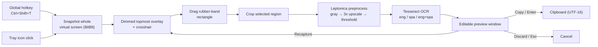
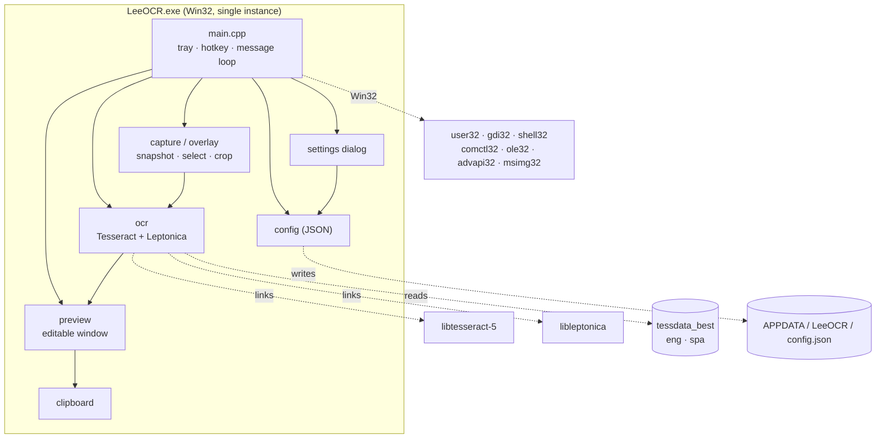

<div align="center">

# 🔎 LeeOCR

### Local screen-region OCR for Windows

Press a hotkey, drag a box over any text on screen, fix any slips in a tiny
preview window, and it's on your clipboard — ready to paste.
**No cloud. No network. Fully offline.**

[](#requirements)
[](#tech-stack)
[](#building-from-source)
[](#tech-stack)
[](LICENSE)
[](CMakeLists.txt)

Built by **[LeeGStudios.com](https://leegstudios.com)**

</div>

---

## Table of contents

- [What it does](#what-it-does)
- [Screenshots](#screenshots)
- [Features](#features)
- [Usage](#usage)
  - [Keyboard shortcuts](#keyboard-shortcuts)
  - [Tray menu](#tray-menu)
- [How it works](#how-it-works)
- [Project structure](#project-structure)
- [Architecture](#architecture)
- [Requirements](#requirements)
- [Building from source](#building-from-source)
- [Packaging a portable folder](#packaging-a-portable-folder)
- [Configuration](#configuration)
- [Tech stack](#tech-stack)
- [Troubleshooting](#troubleshooting)
- [Roadmap](#roadmap)
- [Contributing](#contributing)
- [License](#license)

---

## What it does

LeeOCR is a lightweight system-tray utility for Windows 10/11. It sits silently
in the tray, optionally starts with Windows, and listens for a global hotkey.
When triggered it freezes the screen, lets you drag a rectangle over any text,
runs [Tesseract](https://github.com/tesseract-ocr/tesseract) OCR on just that
region, and drops the recognized text into a small editable preview. Fix any
slips, confirm, and the text is on your clipboard — ready to paste anywhere.

Everything runs **locally** — no cloud OCR, no network calls, no telemetry.

## Screenshots

> _Add a capture GIF or screenshots here — e.g. `docs/demo.gif` showing the
> hotkey → drag-select → preview → paste loop._

| Region select overlay | Editable preview |
| :---: | :---: |
| _`docs/overlay.png`_ | _`docs/preview.png`_ |

## Features

- 🖱️ **Region-select overlay** — drag a box over exactly the text you want;
  multi-monitor and **per-monitor-DPI-v2** aware, so pixels are true across
  mixed-DPI displays.
- ✏️ **Editable preview** — review and correct the text before it hits your
  clipboard, so OCR slips never get pasted blindly.
- 🧠 **Leptonica preprocessing** — grayscale → ~3× upscale → adaptive threshold
  for crisp results on small, anti-aliased screen text.
- 🌐 **Languages** — **English**, **Spanish**, or **English + Spanish**,
  switchable from the tray menu or Settings.
- ⌨️ **Global hotkey** — `Ctrl+Shift+T` by default, rebindable, with a graceful
  fallback to the tray icon if the chord is already taken.
- 🚀 **Start with Windows** — one toggle, no admin rights.
- 📦 **Portable** — a single self-contained folder. No installer, no registry
  clutter beyond an optional autostart key.
- 🔒 **Fully offline** — bundled `tessdata_best` models; no network, ever.

## Usage

1. Launch `LeeOCR.exe`. It appears in the system tray with a startup balloon.
2. Press **`Ctrl+Shift+T`** from any app (or click the tray icon).
3. The screen dims to a frozen snapshot — **drag a rectangle** over the target text.
4. LeeOCR preprocesses and OCRs that region.
5. An editable preview appears (auto-focused, select-all) — tweak if needed.
6. Press **`Enter`** (or **Copy**) → text is on your clipboard → paste with `Ctrl+V`.

### Keyboard shortcuts

| Context | Key / Action | Result |
| --- | --- | --- |
| Anywhere | `Ctrl+Shift+T` (default, rebindable) | Start a capture |
| Overlay | Drag mouse | Rubber-band select a region |
| Overlay | `Esc` or right-click | Cancel — clipboard untouched |
| Preview | `Enter` or **Copy** | Copy text to clipboard, close |
| Preview | `Esc` or **Discard** | Close, clipboard untouched |
| Preview | **Recapture** | Re-open the overlay to drag again |

### Tray menu

Left-click or double-click the tray icon to **capture**. Right-click for the menu:

- **Capture** `(Ctrl+Shift+T)`
- **Language** ▸ English · Spanish · English + Spanish
- **Start with Windows** _(toggle)_
- **Settings…** — rebind the hotkey, pick the default language, autostart toggle
- **About LeeOCR**
- **Quit**

## How it works



**Latency:** capture-to-preview is typically under ~1s for a small region.
Tesseract is initialized lazily on first capture to keep the idle footprint low.

## Project structure

```
IMAGETOTEXT SS/
├── CMakeLists.txt          Build config (CMake + Ninja, links Tesseract/Leptonica)
├── PRD.md                  Product requirements & design decisions
├── README.md               This file
├── LICENSE                 MIT
├── src/
│   ├── main.cpp            WinMain, DPI setup, tray icon, hotkey, message loop, orchestration
│   ├── capture.{h,cpp}     Virtual-screen snapshot, overlay window, rubber-band select, crop
│   ├── overlay.{h,cpp}     Dimmed full-virtual-screen selection surface
│   ├── ocr.{h,cpp}         Tesseract wrapper: init, Leptonica preprocessing, recognize
│   ├── preview.{h,cpp}     Editable preview / output window
│   ├── settings.{h,cpp}    Settings dialog (hotkey rebind, language, autostart)
│   ├── config.{h,cpp}      Load/save %APPDATA%\LeeOCR\config.json
│   ├── clipboard.{h,cpp}   Set clipboard Unicode text
│   ├── winutil.h           UTF-8 ⇄ UTF-16 helpers
│   ├── resource.rc         Resources
│   └── app.manifest        Per-monitor-v2 DPI awareness, common-controls v6
├── tessdata/               tessdata_best models: eng.traineddata, spa.traineddata
├── tools/
│   └── package.ps1         Portable-folder packager (resolves all DLLs)
├── build/                  CMake/Ninja output (git-ignored)
└── dist/                   Packaged portable folder (git-ignored)
```

## Architecture



Every module is classic **Win32 / GDI / Common Controls** — no heavy framework.
See [`PRD.md`](PRD.md) for the full design rationale, build order, and risk log.

## Requirements

**To run** (portable build): Windows 10/11. No install, no admin, no runtime — the
packaged folder ships every DLL it needs plus the `tessdata\` models.

**To build:**
- [**MSYS2**](https://www.msys2.org/) with the **UCRT64** toolchain.
- Packages — GCC, CMake, Ninja, and Tesseract (which pulls in Leptonica):
  ```sh
  pacman -S mingw-w64-ucrt-x86_64-gcc \
            mingw-w64-ucrt-x86_64-cmake \
            mingw-w64-ucrt-x86_64-ninja \
            mingw-w64-ucrt-x86_64-tesseract-ocr
  ```
- The **`best`** trained data for the languages you want, in `tessdata\`. This repo
  ships `eng` + `spa` from the
  [`tessdata_best`](https://github.com/tesseract-ocr/tessdata_best) repository —
  **not** the standard `tesseract-data-*` pacman packages, which are a
  lower-accuracy variant.

## Building from source

From a shell with the UCRT64 `bin` on `PATH` (e.g. `C:\msys64\ucrt64\bin`):

```sh
cmake -S . -B build -G Ninja
cmake --build build
```

This produces `build\LeeOCR.exe` and copies `tessdata\` beside it, so you can run
it in place during development.

## Packaging a portable folder

```powershell
powershell -ExecutionPolicy Bypass -File tools\package.ps1
```

`package.ps1` walks the exe's import table with `objdump` to resolve **every**
dependent DLL transitively and assembles a self-contained `dist\LeeOCR\` — the
`.exe`, all required DLLs (Tesseract, Leptonica, the MinGW runtime, and their
transitive deps), and `tessdata\`. Copy that folder to any Windows 10/11 machine —
**MSYS2 not required** — and run `LeeOCR.exe`.

Resulting ship layout:

```
LeeOCR\
  LeeOCR.exe
  libtesseract-5.dll  libleptonica-6.dll   (+ transitive image/codec DLLs)
  libstdc++-6.dll  libgcc_s_seh-1.dll  libwinpthread-1.dll   (MinGW runtime)
  tessdata\
    eng.traineddata
    spa.traineddata
```

## Configuration

Settings persist to `%APPDATA%\LeeOCR\config.json`, created with sane defaults on
first run and tolerant of a missing/partial/corrupt file.

| Key | Type | Default | Meaning |
| --- | --- | --- | --- |
| `language` | string | `"eng"` | Active OCR language: `"eng"`, `"spa"`, or `"eng+spa"` |
| `hotkeyMods` | int | `6` | Modifier mask (`MOD_CONTROL \| MOD_SHIFT`) |
| `hotkeyVk` | int | `84` | Virtual-key code of the hotkey (`0x54` = `T`) |
| `autostart` | bool | `false` | Register under `HKCU\...\CurrentVersion\Run` |

Edit these from the **Settings…** dialog or the tray menu rather than by hand —
the app keeps the autostart registry key and the registered hotkey in sync with
this file.

## Tech stack

| Layer | Choice |
| --- | --- |
| Language | C++17 |
| UI | Win32 / GDI / Common Controls v6 (no framework) |
| OCR engine | Tesseract 5 (`tessdata_best` LSTM models) |
| Image ops | Leptonica |
| Build | CMake + Ninja |
| Toolchain | MSYS2 **UCRT64 + GCC** |
| DPI | Per-monitor-v2 aware (`SetProcessDpiAwarenessContext`) |

> **Why MSYS2/GCC over MSVC + vcpkg?** MSYS2 ships prebuilt Tesseract/Leptonica
> binaries, avoiding a long first-time source build (the original spec's #1 risk).
> Every API here is classic Win32 and compiles cleanly under GCC. One toolchain
> end-to-end — MinGW-built libs aren't ABI-compatible with an MSVC exe. Full
> rationale in [`PRD.md`](PRD.md).

## Troubleshooting

| Symptom | Cause / Fix |
| --- | --- |
| **"Hotkey Ctrl+Shift+T is in use"** balloon | Another app grabbed the chord. LeeOCR keeps running — capture from the tray icon, or rebind the hotkey in **Settings…**. |
| **"No text found"** balloon | The region had no recognizable text, or it was too small/blurry. Try selecting a tighter box around clear text. |
| **"Could not load OCR models"** | The `tessdata\` folder is missing next to the exe. Ensure `tessdata\eng.traineddata` (and `spa`) sit beside `LeeOCR.exe`. |
| **App won't start / "already running"** | LeeOCR is single-instance — check the system tray; a second launch just focuses the existing one. |
| **Poor accuracy on tiny text** | Zoom the source app before capturing, or select a larger region so preprocessing has more pixels to work with. |

## Roadmap

Out of scope for v1 (see [Non-goals in `PRD.md`](PRD.md#2-goals--non-goals)),
candidates for later:

- [ ] PDF / image-file batch OCR (currently screen-region only)
- [ ] Additional bundled languages
- [ ] Optional installer / MSI (portable folder is the ship target today)
- [ ] Handwriting / heavy document-layout reconstruction

## Contributing

Issues and PRs welcome. Keep the project **fully offline** and dependency-light —
no cloud services, no network calls. Match the existing plain-Win32 style, and
build/verify against **MSYS2 UCRT64 + GCC** before submitting. See
[`PRD.md`](PRD.md) for the module map and design constraints.

## License

Released under the [MIT License](LICENSE). © LeeGStudios.com.

---

<div align="center">

*LeeOCR is a **[LeeGStudios.com](https://leegstudios.com)** project.*

</div>
